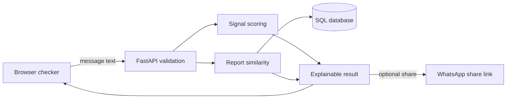
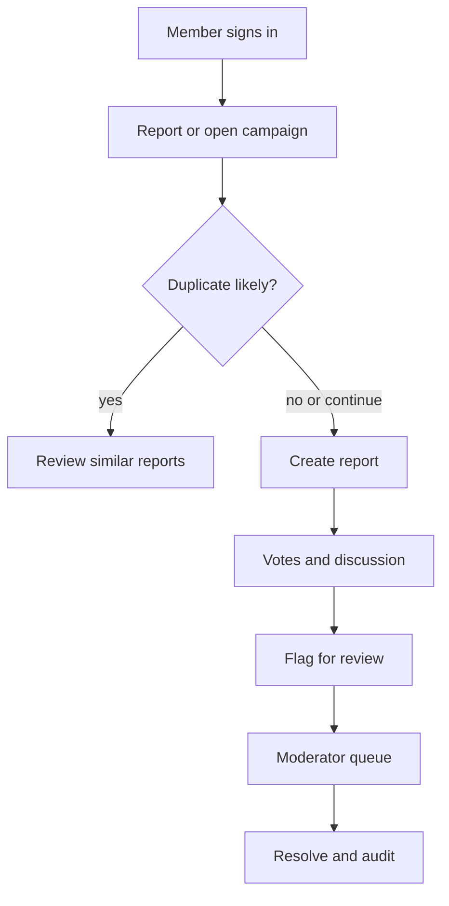
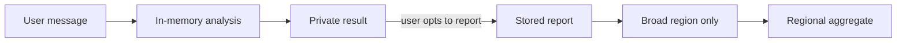

# Architecture diagrams

## Main check flow

```mermaid
flowchart LR
  A[Browser checker] -->|message text| B[FastAPI validation]
  B --> C[Signal scoring]
  B --> D[Report similarity]
  D --> E[(SQL database)]
  C --> F[Explainable result]
  D --> F
  F --> A
  F -->|optional share| G[WhatsApp share link]
```

## Community actions

```mermaid
flowchart TD
  A[Member signs in] --> B[Report or open campaign]
  B --> C{Duplicate likely?}
  C -->|yes| D[Review similar reports]
  C -->|no or continue| E[Create report]
  E --> F[Votes and discussion]
  F --> G[Flag for review]
  G --> H[Moderator queue]
  H --> I[Resolve and audit]
```

## Data boundary

```mermaid
flowchart LR
  A[User message] --> B[In-memory analysis]
  B --> C[Private result]
  C -->|user opts to report| D[Stored report]
  D --> E[Broad region only]
  E --> F[Regional aggregate]
```
